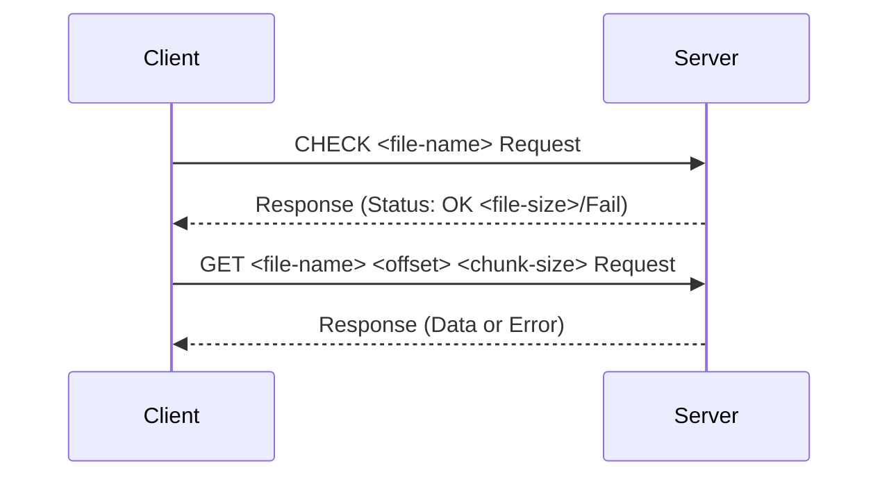

# Concurrent Large File Transport over TCP
*Skills demonstrated: c, networking, protocols, distributed systems, low-level programming* \
A custom (`CHECK`, `GET`) protocol implementation leveraging TCP for communicating large file buffers in a client-server architecture. \
Distributes chunks of a file across multiple servers and downloads them concurrently via clients, then assembles the chunks into the original file. \
Uses multithreading for parallel downloads.

## Get Started

Run makefile to kill server ports, build client & server executables, and generate large file `example_file.txt`.
```
make kill && make all && make generate
```

In a local terminal window, run the servers listed in `server_info.txt`.
```
./server 1024 && ./server 1025 && ./server 1026
```

In another local terminal window, run the client.
```
./client server-info.txt 3 example_file.txt
```

Wait for file progress to complete, then check that `example_file.txt` is identical to `output.dat`.
```
make check
```

Remove artifacts and release ports.
```
make clean && make kill
```

## Features

### Architecture Mechanics
Servers host different parts of a file or can serve overlapping parts of the same file. \
Clients request specific offsets and chunk sizes, which are downloaded in parallel using threads. \
Implements a custom protocol (CHECK and GET) for communication between the client and servers. \
`CHECK example_file.txt` to retrieve its file size. \
`GET example_file.txt 0 34952533` to retrieve file data from 0 bytes to 34952533 bytes.

Client-server sequence diagram:


## Design Considerations & Further Exploration
- reliability
- speed (benchmarks?)
- fault tolerance
- implement mirror selection logic on the client (e.g., choosing the fastest server).

## How this code is similar to TCP

1. Connection-Oriented:
    - TCP is a connection-oriented protocol, meaning a connection is established before any data is sent.
    - Your code establishes connections between the client and the server using connect() on the client side and accept() on the server side.

2. Reliable Data Transfer:
    - TCP ensures reliable delivery of data by handling retransmissions, acknowledgments, and reordering.
    - Your code relies on TCP’s built-in reliability to transfer file chunks without worrying about packet loss or ordering.

3. Stream-Based Communication:
    - TCP provides a byte-stream abstraction where data is sent and received in chunks.
    - Your code sends file chunks as a stream using send() and reads them using recv().

4. Simplified Application Logic:
    - With TCP, your code doesn't have to worry about implementing low-level reliability features (e.g., packet retransmission or sequencing).
    - UDP requires you to manually implement these features, which significantly increases complexity.
